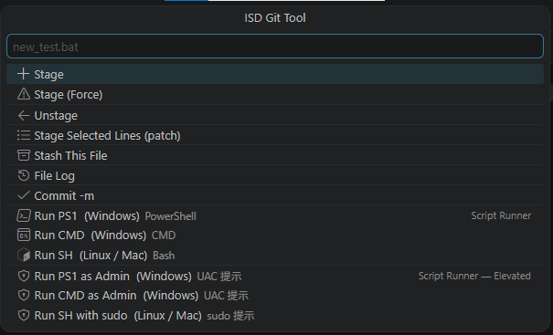

# ISD Simple Git

> Lightweight VS Code extension that adds a single **ISD: Git Tool** entry to the Explorer and Editor right-click menus — keeping your context menu clean while giving you instant access to the most common Git and script-runner operations.



---
| **Run SH with sudo** | Linux / Mac | Bash with `sudo` |

## Installation

This README documents features and usage for Git users. Development and publishing instructions have been moved to the developer notes file `dev.md`.

For quick development/testing, see **Developer Setup** below.


---

## Requirements

- VS Code **1.60+**
- `git` available on `PATH`

---

## Installation

### From VSIX (local / sharing)

1. Package the extension:

```bash
npx @vscode/vsce package
# → isd-simple-git-0.1.0.vsix
```

2. Install the VSIX:

```bash
code --install-extension isd-simple-git-0.1.0.vsix
```
---

## Usage

1. Right-click any file in the **Explorer** or **Editor** tab.
2. Select **ISD: Git Tool** — a quick-pick menu appears with all available actions for that file.
3. Choose an action.

For **Stage Selected Lines**, first highlight the lines you want in the editor, then open **ISD: Git Tool** → **Stage Selected Lines (patch)**.

---

## Developer Setup

1. Open this folder in VS Code.
2. Press `F5` → an **Extension Development Host** window opens.
3. Right-click any file → **ISD: Git Tool** to test commands.

---

## Project Structure

| File | Purpose |
|---|---|
| `extension.js` | Full extension implementation |
| `package.json` | Extension manifest (commands, menus, metadata) |
| `docs/AllFeatures.png` | Screenshot used in this README |

---

## License

[MIT](LICENSE.txt)
